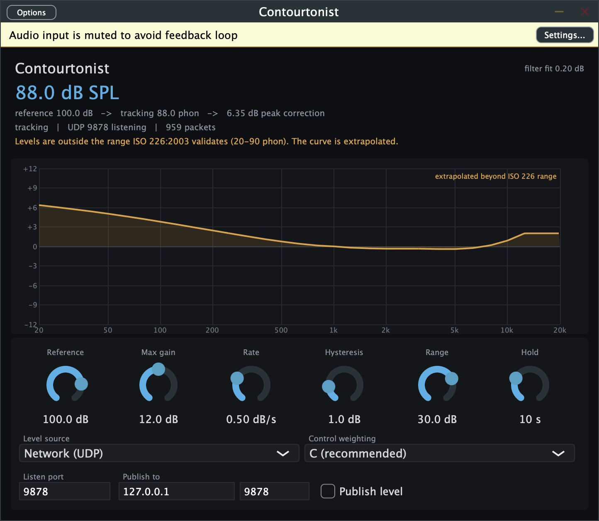
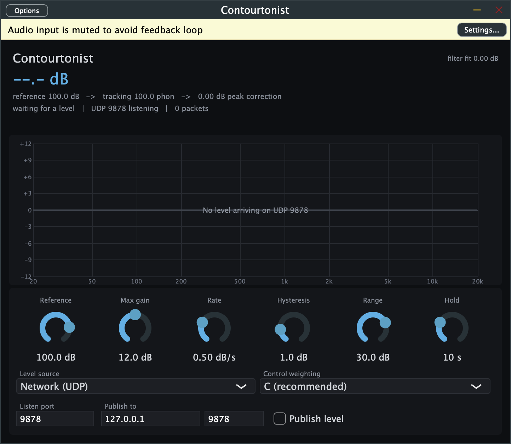
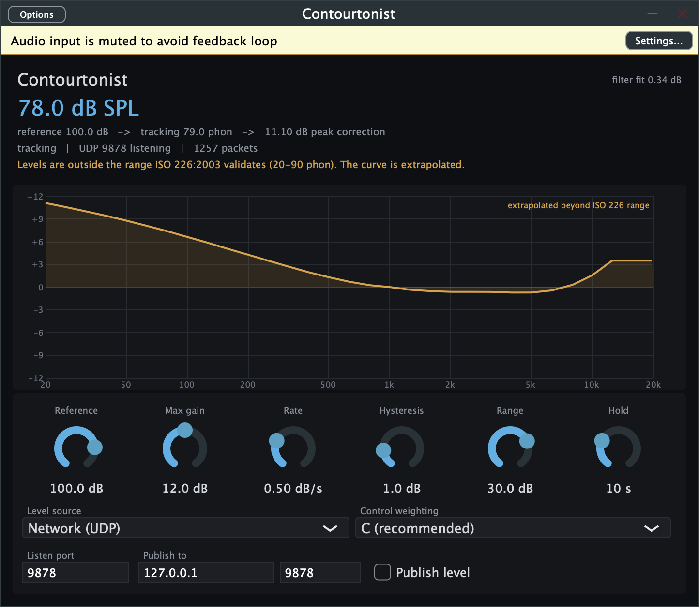

# Contourtonist user guide

Contourtonist is **an equal-loudness compensation EQ that tracks how loud the room actually is**.
It measures the room — from a calibrated measurement microphone or an SPL meter's live output —
and applies the EQ curve that keeps the tonal balance the system was tuned for as the level
moves. When a noise limit pulls the show down 8 dB, the bass does not leave with it.

> **Before you rely on this:** the ISO 226:2003 coefficients are transcribed from the standard and
> checked against it by the test suite; the filter bank's accuracy, the control loop's stability
> and the meter parsers are measured rather than asserted; the AU passes `auval`. But it has
> **never been used on a real system, with a real microphone, at a real show**. Nothing here has
> been checked against a reference sound level meter, and **no hardware calibrator has ever been
> connected**. Review it before use on live gear.
>
> This codebase was created with AI assistance, directed and reviewed by a human author.

---

## The idea

A mix balanced at 100 dB and reproduced at 88 dB has not simply got quieter. Human hearing is
less sensitive at low frequencies at low levels, and strongly so, which means a uniform 12 dB
drop takes far more perceived bass away than it takes midrange. ISO 226:2003's equal-loudness
contours describe exactly that relationship.

Take the contour at the reference level, take the contour at the measured level, and the
difference — normalised at 1 kHz — is the correction:

```
G(f) = (reference − current) − [ Lp(f, reference) − Lp(f, current) ]
```

At 1 kHz `Lp(1k, P) == P` by definition, so `G(1 kHz)` is identically zero.

> **The curve can only ever change tonal balance, never level.** That is not a convention, it is
> arithmetic, and the test suite pins it. This is a system EQ, not a slow automatic fader.

---

## How it is wired

The host owns the audio device, so a plugin instance cannot open the measurement microphone
itself. Contourtonist therefore splits in two:

- **The standalone owns the microphone and the calibration.** It measures a sliding short-term
  Leq and publishes the level over UDP.
- **Plugin instances subscribe to that level** and apply the curve to their own audio.

One microphone drives every instance in the session, which is what a live rig with several
processing chains wants anyway.

A plugin *can* instead measure its own audio input. That is right in the standalone and usually
wrong in a plugin — a plugin listening to its own output is measuring the thing it is correcting.
The GUI says so.

---

## The window



Reading from the top:

- **The big number** is the measured level, and the line under it is the whole chain in one
  sentence: `reference 100.0 dB → tracking 88.0 phon → 6.35 dB peak correction`.
- **The status line** — `tracking | UDP 9878 listening | 959 packets` — is where you find out
  whether levels are actually arriving. A packet count that has stopped moving is the fault.
- **The amber line** warns when the level is outside ISO 226's validated range and the curve is
  being extrapolated. See [Known limits](#known-limits).
- **`filter fit`**, top right, is how closely the filter bank reproduces the ideal curve.
- **The curve** is the correction being applied, always passing through 0 dB at 1 kHz.

The banner at the very top — *"Audio input is muted to avoid feedback loop"* — appears in the
standalone when it is both measuring and passing audio, which would otherwise be a microphone
listening to the speaker it is driving.

---

## The controls

| Control | What it does |
|---|---|
| **Reference** | The level the system was tuned at. The curve is flat when the room reads this. |
| **Max gain** | Hard ceiling on the curve. Limiting **scales** the curve rather than clipping it, so its shape survives. |
| **Rate** | How fast the curve is allowed to move, in dB/s. Default 0.5. Audible EQ movement is worse than slightly stale compensation. |
| **Hysteresis** | Level change required before the curve responds at all. Stops it chasing normal programme variation. |
| **Range** | How far below the reference it will track. An unplugged microphone reads as a very quiet room; without this that becomes a demand for maximum boost. |
| **Hold** | How long the curve holds after levels stop arriving, before releasing to flat. |

**Level source** picks where the measurement comes from; **Control weighting** picks the
weighting used *for control*.

> **A-weighting is a poor control input.** It *is* an equal-loudness curve, so using it applies
> part of the correction twice. **C is the default and the right answer.** Shows are still
> policed in dB(A), so the standalone measures what you need for compliance and controls on what
> is correct.

**Listen port**, **Publish to** and **Publish level** are the UDP plumbing between the standalone
and the plugin instances.

---

## Level sources

| Source | Status |
|---|---|
| Generic UDP line protocol | **Tested**, over real sockets |
| This instance's audio input | Tested against synthetic signals |
| NTi XL2 | Parser tested; **written from published docs, never seen an XL2** |
| Datalogger CSV | Parser tested, including European decimal separators |
| 10EaZy | **Not implemented** — see [meters.md](meters.md) |

### The UDP protocol

Deliberately trivial, so that any meter can drive it. One reading per datagram, as text:

```
95.3 A leq
```

A bare number works too. That means a meter Contourtonist has never heard of can drive it from a
few lines of script — and that `nc` is a working diagnostic:

```bash
echo "88.0" | nc -u -w1 127.0.0.1 9878
```

To watch the curve move without a meter at all:

```bash
python3 -c "
import socket, time
s = socket.socket(socket.AF_INET, socket.SOCK_DGRAM)
for _ in range(120):
    s.sendto(b'88.0 C leq\n', ('127.0.0.1', 9878))
    time.sleep(0.25)
"
```

---

## Safety

This sits across a live output and changes it based on a microphone listening to that same
output. That is a closed loop, and the design takes it seriously:

- **The loop is negative feedback.** More boost raises the measured level, which reduces the
  demanded boost. It converges rather than running away, and the controller tests simulate it
  across a range of acoustic couplings to show that it does.
- **Rate limited**, including on the very first measurement.
- **Hard ceiling**, applied by scaling the curve rather than clipping it.
- **Bounded tracking range**, so a dead microphone cannot demand maximum boost.
- **Fails to flat.** If the level stops arriving, the curve holds for **Hold**, then releases to
  flat — the sound the system was tuned for.



*It does not invent a measurement when it hasn't got one.*

---

## Known limits

- **ISO 226:2003 is validated from 20 to 90 phon** (80 phon above 5 kHz), and live sound operates
  above that. Strict conformance means no compensation at show level, so the default extrapolates
  beyond the validated range and says so — in the GUI and in the API. Turn **Extend past ISO 226**
  off for strict behaviour.
- **The contours are for pure tones in a free field**, and programme material is neither.
  Treating a measured broadband level as a loudness level is the approximation every loudness
  control has made since Fletcher and Munson, but it is an approximation. A full loudness model
  (ISO 532) would be more correct and is not implemented.
- **The filter bank fits the curve to about 0.44 dB** worst case at the 12 dB ceiling, 0.19 dB at
  6 dB, concentrated at 20 Hz and above 10 kHz. Measured, not assumed.
- **The built-in weighting filters lose accuracy above 10 kHz** at 44.1/48 kHz, where a matched
  Z-transform aliases. It costs 0.31 dB on a broadband A-weighted reading of pink noise —
  irrelevant to the compensation, and **not** irrelevant if you are logging the number for
  compliance. Use a real meter for that, or run at 96 kHz. See [weighting.md](weighting.md).



---

## Installing the plugins on macOS

The macOS artefacts are **unsigned**, so Gatekeeper quarantines them and a DAW's plugin scan will
reject them until you clear it. **Approving the outer bundle does not unquarantine what is nested
inside it**, so clear each one explicitly:

```bash
xattr -dr com.apple.quarantine "/Library/Audio/Plug-Ins/VST3/Contourtonist.vst3"
xattr -dr com.apple.quarantine "/Library/Audio/Plug-Ins/Components/Contourtonist.component"
xattr -dr com.apple.quarantine "/Applications/Contourtonist.app"
```

---

## Troubleshooting

| Symptom | Cause |
|---|---|
| **Curve is flat and won't move** | No levels arriving. Check the packet count in the status line, not the level readout. |
| **Level reads dashes** | Nothing has been received, or **Hold** has expired and it released to flat. |
| **Curve moves too slowly to follow the show** | That is **Rate**, and it is deliberate. Raise it knowing audible EQ movement is the cost. |
| **Curve pegged at the ceiling** | The room is far below **Reference**, or **Reference** is set too high for what you are actually running. |
| **Amber "extrapolated" warning** | Show levels are above ISO 226's validated 90 phon. Expected; turn off **Extend past ISO 226** for strict behaviour. |
| **Plugin measures its own output and misbehaves** | Level source is set to the instance's audio input. In a plugin you almost always want Network (UDP). |
| **Standalone mutes its audio input** | Deliberate — it is measuring and passing audio at once, which would be a feedback loop. |
| **DAW's plugin scan rejects it on macOS** | Quarantine. Clear it on the `.vst3` and `.component` themselves, not just the app. |
| **A-weighted compliance number disagrees with the meter** | Above 10 kHz the built-in weighting aliases. Log from a real meter. |

---

## See also

- [control-loop.md](control-loop.md) — the controller, its stability analysis and the simulation
- [weighting.md](weighting.md) — the weighting filters and where they lose accuracy
- [meters.md](meters.md) — supported meters, and why 10EaZy isn't among them
- [README](../README.md) — the idea, the status table and the download links
